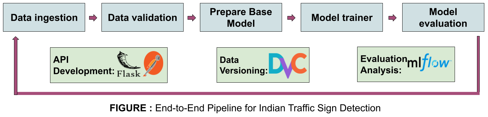
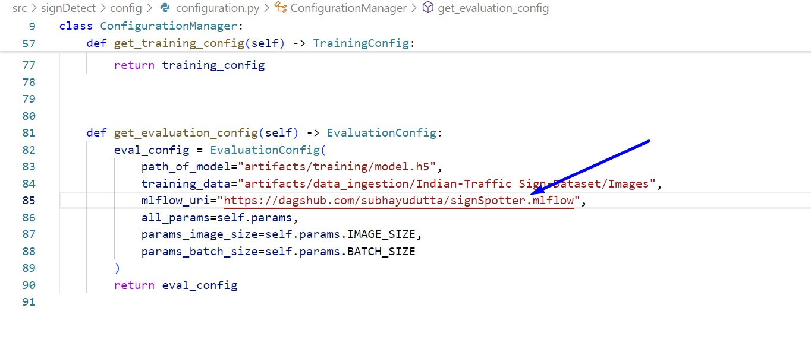
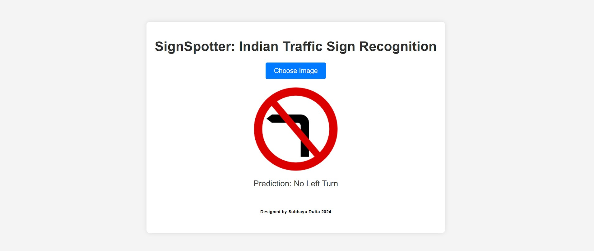

# TrafficSignSpotter

TrafficSignSpotter predicts Indian traffic signs by analyzing images, leveraging advanced machine learning algorithms to ensure accurate recognition and timely detection, enhancing road safety and compliance with traffic regulations.

The main objective of this project is to develop a robust pipeline for traffic sign detection that incorporates various MLOps practices such as robus pipeline, version control, experiment tracking, and model performance monitoring.

In this README, we will walk you through the folder structure, pipeline stages, the model used, how to run the code, analysis using MLflow and DagsHub, evaluation metrics, dependencies, conclusion, future work, and acknowledgements.

## Folder Structure

- **src/signDetect**: This directory contains the main source code for the project.
  - **components**: This subdirectory holds reusable components used in the pipeline, such as data ingestion, validation, prepare base model, model trainer, and model evaluation.
  - **utils**: Here, utility functions and helpers are stored, facilitating various tasks throughout the project.
  - **logging**: Contains configurations and setup for logging functionalities.
  - **config**: Holds project configuration files, including the main configuration file `configuration.py`.
  - **pipeline**: This directory houses the pipeline definition and stages, including data ingestion, validation, prepare base model, model trainer, and model evaluation.
  - **entity**: Contains entity classes used in the project, such as `config_entity.py`.
  - **constants**: Holds constant values used across the project.

- **config**: This directory contains project-wide configuration files, including `config.yaml` for general configurations and `params.yaml` for parameter configurations.

- **app.py** and **main.py**: These files serve as entry points for running the application and executing the main functionality.

- **Dockerfile**: This file specifies the instructions to build a Docker image for the project, ensuring consistency and portability of the environment.

- **requirements.txt**: Lists all the Python dependencies required to run the project. Useful for setting up the environment.

- **setup.py**: This file defines metadata about the project and its dependencies. Useful for packaging and distribution.

## Pipeline Stages

### Data Ingestion
Data is acquired from Kaggle (https://www.kaggle.com/datasets/dataclusterlabs/indian-sign-board-image-dataset) and stored on Google Drive for easy access. To retrieve the data, we use the `gdown` library to download it from Google Drive and store it in the local environment. Subsequently, the downloaded data is saved in the artifacts folder within the data ingestion directory. We then use the `zipfile` module to unzip the downloaded file, ensuring that the data is readily available for further processing.

### Data Validation
In this stage, we perform thorough validation checks on the acquired data to ensure its integrity and quality. All necessary files are examined for completeness, consistency, and adherence to predefined standards. The validation process involves verifying file formats, data types, and structural integrity. The results of the validation checks are recorded in a `status.txt` file within the artifacts folder of the data validation directory. This allows for easy tracking and monitoring of the data validation process.

### Prepare Base Model

Preparing the base model involves augmenting the data with techniques like rotation, scaling, and flipping to enhance image diversity. Utilizing the VGG16 model, we leverage pre-trained weights to extract rich features, ensuring improved accuracy and robustness in traffic signal recognition tasks.

### Model Trainer
The model training stage involves preparing the data for model training and defining the neural network architecture. We split the preprocessed data into input features (`X_train`) and target labels (`y_train`). Then, we define a Sequential model using Keras, a high-level neural networks API. The model architecture includes an Embedding layer to convert images into dense vectors, a SpatialDropout1D layer to prevent overfitting, a VGG16 layer for feature extraction, and a Dense layer with softmax activation for multi-class classification. After training the model, we save the tokenizer used for text tokenization and the trained model weights as `model.h5`, respectively, in the artifacts folder within the model trainer directory.

### Model Evaluation
Model evaluation is performed to assess the performance of the trained model on unseen data. This involves:
- Splitting the preprocessed data into training and validation sets to evaluate the model's generalization capability.
- Saving the model scores and evaluation metrics, such as accuracy, precision, recall, and F1-score, for further analysis.
- Utilizing MLflow, an open-source platform for managing the end-to-end machine learning lifecycle, for experiment tracking and monitoring. MLflow enables us to log parameters, metrics, and artifacts, facilitating reproducibility and collaboration.

The workflow of the pipeline, from data ingestion to model evaluation, is visualized in the provided image, showcasing the sequential flow of operations.




## How to Run the Code

To run the code, follow these steps:

### Clone the repository:
```bash
git clone https://github.com/subhayudutta/SignSpotter.git
```

### Setting up the Environment

Activate the Conda environment named `review` using the following command:
   ```bash
   conda activate signDetect
   pip install -r requirements.txt
   ```

### Running the Pipeline
To execute all pipeline stages, you have two options:

1. Run main.py using Python:
    ```bash
    python main.py
    ```
This command will execute all pipeline stages sequentially.

2. Alternatively, you can use DVC (Data Version Control) to run the pipeline:
    ```bash
    dvc init  # Initializes DVC in your project directory.
    dvc repro  # Reproduces the pipeline defined in the DVC file to ensure data lineage and reproducibility.
    dvc dag  # Visualizes the pipeline as a directed acyclic graph (DAG), showing dependencies between stages.
    ```
This command will reproduce the pipeline using DVC, ensuring data lineage and reproducibility.

### Running the Flask App
To run the Flask web application, execute the following command:
```bash
python app.py
```
This command will start the Flask server with the specified host (0.0.0.0) and port (8080). This allows the Flask app to be accessible from any network interface on the specified port.

### Predicting Traffic Sign
Once the Flask app is running, you can access the following endpoints:
```
/predict: Use this endpoint to predict tarffic sign for a given image input. You can either use cURL commands or visit the endpoint through your web browser.
```

### Training the Model
To train the traffic sign analysis model, use the following endpoint:
```
/train: Use this endpoint to trigger model training. You can either use cURL commands or visit the endpoint through your web browser.
```

### Testing Endpoints with Postman
You can use Postman, a popular API testing tool, to interact with the Flask app endpoints:

1. Open Postman and create a new request.
2. Set the request type to POST.
3. Enter the URL of the Flask app endpoint you want to test (e.g., http://localhost:5000/predict or http://localhost:5000/train).
4. If necessary, add any required headers or body parameters.
5. Click the "Send" button to make the request and view the response.

You can use Postman to test both the /predict and /train endpoints for predicting traffic sign and training the model, respectively.

This section provides comprehensive instructions for running the code, including setting up the environment, running the pipeline, starting the Flask app, and interacting with the traffic sign analysis model. Let me know if you need further assistance!

## Analysis using MLflow and DagsHub

To integrate your code with DagsHub for experiment tracking using MLflow, follow these steps:

1. Connect the code of your GitHub repository to DagsHub. Ensure you have the following environment variables set up:
   ```bash
   MLFLOW_TRACKING_URI=https://dagshub.com/username/signDetect
   MLFLOW_TRACKING_USERNAME=<your_username>
   MLFLOW_TRACKING_PASSWORD=<your_token>
    ```

2. You can set these variables in your command prompt (cmd) using the following commands:
    ```bash
    set MLFLOW_TRACKING_URI=https://dagshub.com/username/signDetect.mlflow
    set MLFLOW_TRACKING_USERNAME=<your_username>
    set MLFLOW_TRACKING_PASSWORD=<your_token>
    ```
For Git Bash, use the export command instead of set.

3. Update the MLflow tracking URI in your code to point to your DagsHub repository. You can do this in the src/reviewAnalysis/config/configuration.py file, specifically in the get_evaluation_config function where the mlflow_uri is defined.


4. After running the pipeline using DVC (Data Version Control) with dvc repro, you can check the MLflow experiments through the DagsHub URL provided. You'll be able to view and analyze the experiment runs, including metrics, parameters, and artifacts.

5. Play around with the MLflow experiments in DagsHub to gain insights into the performance of your models and track the progress of your project.

This section provides detailed instructions for integrating your code with DagsHub for experiment tracking using MLflow. Let me know if you need further assistance!

## Dependencies

This project relies on the following external libraries and packages:

- numpy: Library for numerical computing in Python.
- pandas: Data manipulation and analysis library.
- tensorflow: Open-source machine learning framework.
- matplotlib: Plotting library for creating visualizations.
- seaborn: Statistical data visualization library based on matplotlib.
- nltk: Natural Language Toolkit for text processing.
- regex: Regular expression operations library.
- ipykernel: IPython kernel for Jupyter notebooks.
- mlflow: Open-source platform for managing the end-to-end machine learning lifecycle.
- Flask: Lightweight WSGI web application framework.
- Jinja2: Template engine for Python.
- PyYAML: YAML parser and emitter for Python.
- python-box: Simple Python library for creating dictionaries with attribute-style access.
- ensure: Library for validating conditions in Python.
- dvc: Data Version Control for managing ML models and data pipelines.
- gdown: Command-line tool for downloading large files from Google Drive.

### Installation

To install the dependencies, first create a Python environment (optional but recommended) and then use pip to install the required packages:

1. **Create Python Environment**: Navigate to your project directory and create a Python environment using virtualenv or conda (if not already created):
   
   ```bash
   # Using virtualenv
   python3 -m venv myenv
   source myenv/bin/activate

   # Using conda
   conda create --name myenv python=3.8
   conda activate myenv
    ```

2.  **Install Required Packages**:Use pip to install the dependencies listed in the requirements.txt file:
    ```bash
    pip install -r requirements.txt
    ```

3. **Run the Application**: Once all dependencies are installed, you can run the Flask application:
    ```bash
    python app.py
    ```

This section provides users with clear instructions on how to install the dependencies required for the project to run successfully. Adjust the dependencies and installation instructions according to the specific requirements of your project. Let me know if you need further assistance!

## Screenshot of the Live App

Here is a screenshot of the live traffic sign detection application:



## Conclusion

In conclusion, this project showcases the implementation of traffic sign detection using modern machine learning techniques and DevOps practices. By leveraging libraries such as TensorFlow, NLTK, and Flask, I have developed a robust traffic sign analysis model.

Throughout the project, I have emphasized the importance of reproducibility and scalability. I have utilized DVC for versioning our data and models, while MLflow has enabled us to track experiments and monitor model performance effectively.

As I continue to evolve this project, I aim to further enhance the model's accuracy and scalability, explore additional deployment options, and integrate more advanced features for better analysis and insights.

I welcome contributions from the community to help us improve and expand the capabilities of this project. Whether it's through bug fixes, feature enhancements, or new ideas, together we can make this project even more impactful in the field of traffic sign analysis and beyond.

## License and Acknowledgements

This project is licensed under the [GNU License](LICENSE.md). Feel free to use, modify, and distribute the code for your own purposes.

I would like to acknowledge the contributions of the open-source community, without which this project would not have been possible. Special thanks to the creators and maintainers of libraries, frameworks, and tools that have been instrumental in the development and deployment of this project.

## Contact Me

For any inquiries, feedback, or collaboration opportunities, please feel free to reach out to me via email at duttasuvo90@gmail.com.

